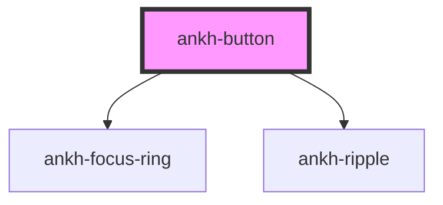

# ankh-button

<!-- Auto Generated Below -->

## Properties

| Property    | Attribute    | Description                                                | Type                                                        | Default    |
| ----------- | ------------ | ---------------------------------------------------------- | ----------------------------------------------------------- | ---------- |
| `disabled`  | `disabled`   | Whether the button is disabled                             | `boolean`                                                   | `false`    |
| `fullWidth` | `full-width` | Whether the button should take full width of its container | `boolean`                                                   | `false`    |
| `size`      | `size`       | The size of the button                                     | `"large" \| "medium" \| "small"`                            | `'medium'` |
| `type`      | `type`       | The type attribute for the button                          | `"button" \| "reset" \| "submit"`                           | `'button'` |
| `variant`   | `variant`    | The visual style variant of the button                     | `"elevated" \| "filled" \| "outlined" \| "text" \| "tonal"` | `'filled'` |

## Dependencies

### Depends on

- [ankh-focus-ring](../ankh-focus-ring)
- [ankh-ripple](../ankh-ripple)

### Graph

----------------------------------------------

*Built with [StencilJS](https://stenciljs.com/)*
