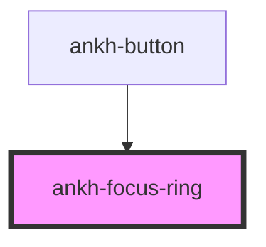

# ankh-focus-ring

<!-- Auto Generated Below -->

## Properties

| Property  | Attribute | Description                                  | Type      | Default |
| --------- | --------- | -------------------------------------------- | --------- | ------- |
| `inward`  | `inward`  | Whether to animate inward instead of outward | `boolean` | `false` |
| `visible` | `visible` | Whether the focus ring is visible            | `boolean` | `false` |

## Dependencies

### Used by

 - [ankh-button](../ankh-button)

### Graph

----------------------------------------------

*Built with [StencilJS](https://stenciljs.com/)*
