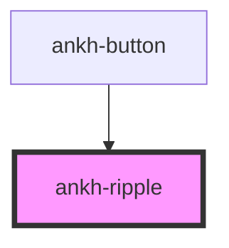

# ankh-ripple

<!-- Auto Generated Below -->

## Properties

| Property   | Attribute  | Description                           | Type      | Default |
| ---------- | ---------- | ------------------------------------- | --------- | ------- |
| `disabled` | `disabled` | Whether the ripple effect is disabled | `boolean` | `false` |

## Dependencies

### Used by

 - [ankh-button](../ankh-button)

### Graph

----------------------------------------------

*Built with [StencilJS](https://stenciljs.com/)*
